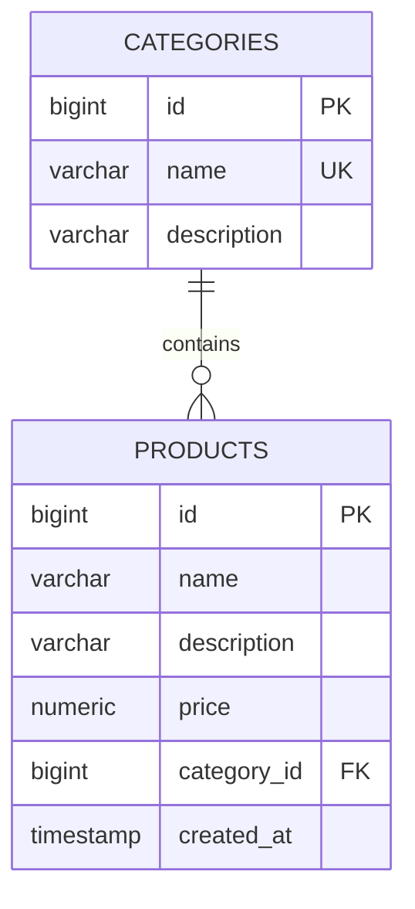

# E-Commerce Platform

A Spring Boot e-commerce backend, built step by step from a simple monolith to a production-style microservices architecture with Docker and CI/CD.

> **Status:** Phase 1 in progress (monolith CRUD). See the [roadmap](#roadmap).

## Tech stack

| Area | Technology |
|---|---|
| Language | Java 21 |
| Framework | Spring Boot 3.5, Spring Web, Spring Data JPA, Bean Validation |
| Database | PostgreSQL 16 |
| Build | Maven (wrapper included) |
| Containers | Docker, Docker Compose |
| Planned | Spring Security + JWT, Spring Cloud (Eureka, Gateway, OpenFeign), Resilience4j, GitHub Actions, OpenAPI/Swagger |

## Getting started

### Prerequisites

- Java 21
- Docker Desktop (running)

Maven is not required, the project ships with the Maven wrapper.

### Run locally

```bash
# 1. Start PostgreSQL
docker compose -f infra/docker-compose.yml up -d

# 2. Start the application
cd monolith
./mvnw spring-boot:run        # on Windows: mvnw spring-boot:run
```

The API is available at `http://localhost:8080`.

To try the endpoints, open `docs/requests.http` in VS Code (REST Client extension) or IntelliJ.

### Stop

```bash
docker compose -f infra/docker-compose.yml stop
```

## API endpoints
## Endpoints

### Categories
| Méthode | URL | Description | Code |
|---|---|---|---|
| GET | /api/categories | Liste des catégories | 200 |
| GET | /api/categories/{id} | Détail d'une catégorie | 200 / 404 |
| POST | /api/categories | Créer | 201 / 409 |
| PUT | /api/categories/{id} | Modifier | 200 / 404 |
| DELETE | /api/categories/{id} | Supprimer | 204 / 409 |

### Products
| Méthode | URL | Description | Code |
|---|---|---|---|
| GET | /api/products | Liste des produits | 200 |
| GET | /api/products/{id} | Détail d'un produit | 200 / 404 |
| POST | /api/products | Créer | 201 / 400 / 404 |
| PUT | /api/products/{id} | Modifier | 200 / 400 / 404 |
| DELETE | /api/products/{id} | Supprimer | 204 / 404 |

### Categories

| Method | URL | Description | Status codes |
|---|---|---|---|
| GET | `/api/categories` | List categories | 200 |
| GET | `/api/categories/{id}` | Get one category | 200, 404 |
| POST | `/api/categories` | Create a category | 201, 400, 409 |
| PUT | `/api/categories/{id}` | Update a category | 200, 400, 404, 409 |
| DELETE | `/api/categories/{id}` | Delete a category | 204, 404, 409 |

### Products (in progress)

| Method | URL | Description |
|---|---|---|
| GET | `/api/products` | List products (search and pagination planned) |
| GET | `/api/products/{id}` | Get one product |
| POST | `/api/products` | Create a product |
| PUT | `/api/products/{id}` | Update a product |
| DELETE | `/api/products/{id}` | Delete a product |

## Database schema



## Project structure

```
.
├── monolith/        Spring Boot application (Phases 1 to 4)
│   └── src/main/java/com/monssef/ecommerce/
│       ├── category/    entity, repository, service, controller
│       ├── product/     entity, repository (service and controller in progress)
│       └── common/      shared classes (exceptions)
├── services/        microservices (Phase 5 and later)
├── infra/           Docker Compose files
└── docs/            HTTP request examples, architecture notes
```

The code is organized by feature rather than by layer, which makes the later split into microservices straightforward.

## Roadmap

| Phase | Goal | Status |
|---|---|---|
| 1 | Monolith CRUD (products and categories) | In progress |
| 2 | Spring Security, JWT, roles (USER / ADMIN) | Planned |
| 3 | Cart, orders, stock management | Planned |
| 4 | DTOs, exception handler, Swagger, tests, Docker, Actuator | Planned |
| 5 | Split into microservices (auth, product, order, payment, gateway, Eureka) | Planned |
| 6 | OpenFeign, Resilience4j, advanced Docker Compose | Planned |
| 7 | CI/CD with GitHub Actions | Planned |
| 8 | Deployment and frontend (bonus) | Planned |

Work is tracked with GitHub issues and a project board. Each issue is delivered through its own branch and pull request.

## License

MIT